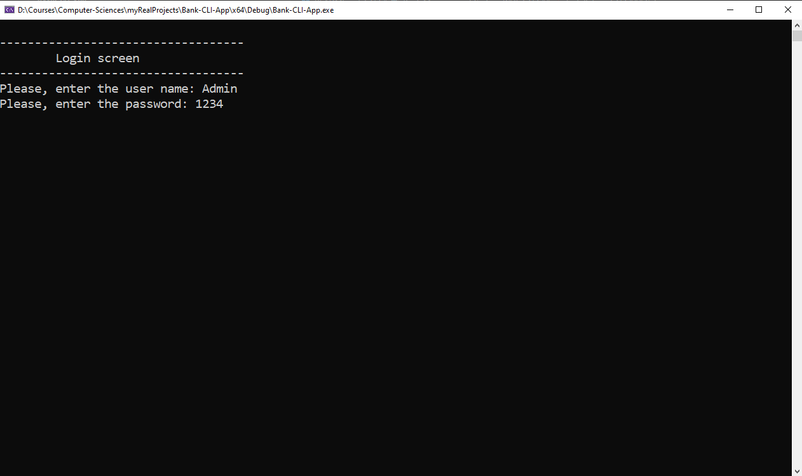
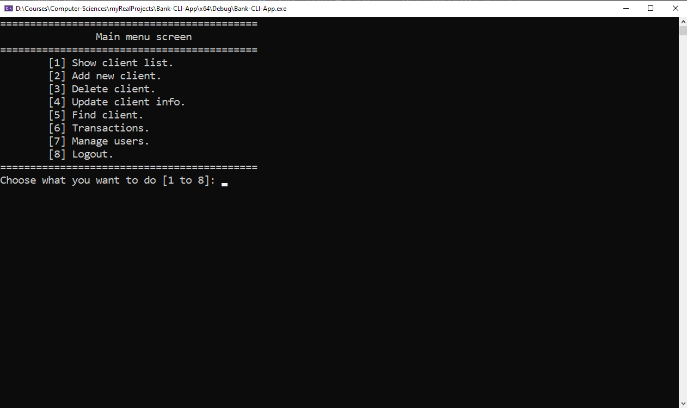

# 🏦 Bank-CLI-App

[](https://isocpp.org/std/the-standard)
[](https://opensource.org/licenses/MIT)
[](https://learn.microsoft.com/en-us/windows)
[](https://visualstudio.microsoft.com/)


A secure command-line banking system developed in C++ for managing clients, transactions, and user permissions with multi-level access control.

## 🖥️ Screenshots

| Login Screen | Main Menu | Manage Users Menu |
|--------------|-----------|-------------------|
|  |  |  |

## 🌟 Features
- Client management (Add/Delete/Update/Find/List)
- Financial transactions (Deposit/Withdraw)
- User management with permissions system
- Secure login system
- Clean console interface

## Requirements
- C++ compiler (supporting C++11 or later)
- Standard Library

## Installation
1. Clone the repository:
```bash
git clone https://github.com/AbdulrahmanFrontend/Bank-CLI-App.git
```
2. Open in Visual Studio:
    - Double-click Bank-CLI-App.sln, OR
    - In VS: File → Open → Project/Solution → Select .sln file
3. Build & Run:
    - Press Ctrl + F5 (Run without debug) or F5 (Debug mode)

## Usage
- Use the default admin account (Username: Admin, Password: 1234, permission: -1(full access to all features of the app))
- Follow the on-screen menus to navigate through the system
- All data is saved in text files (`Clients.txt` and `Users.txt`)

## File Structure
- `Clients.txt`: that will be built during the run time
- `Users.txt`: Stores user accounts and permissions

## 📜 License
This project is licensed under the MIT License - see the  file for details.

## Contributing
Pull requests are welcome. For major changes, please open an issue first to discuss what you would like to change.
